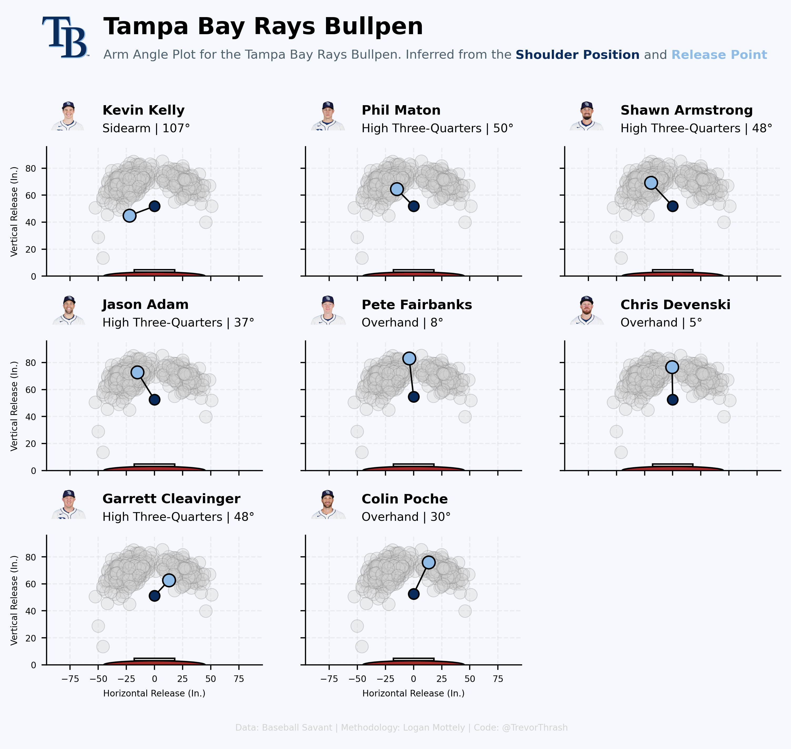
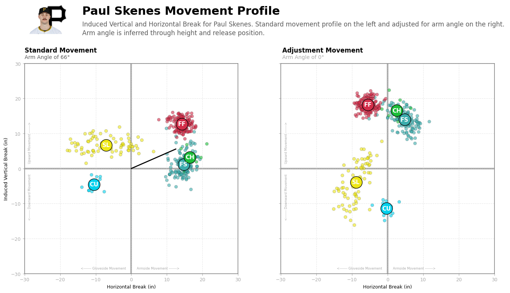
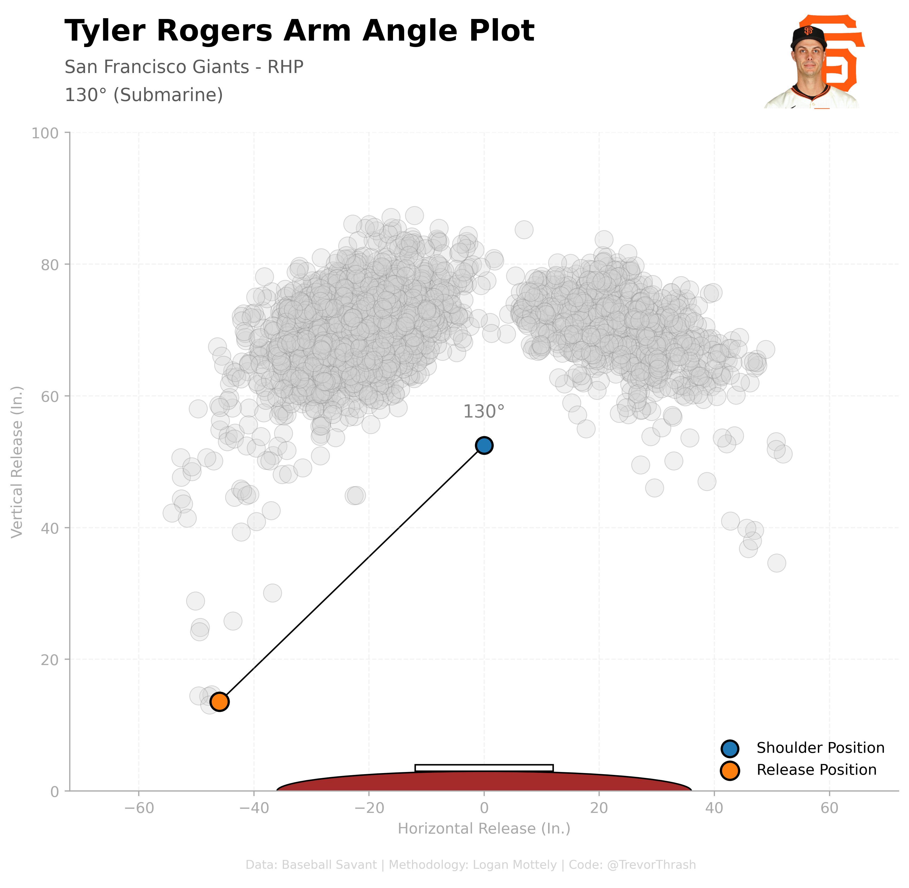

# MLB Arm Angles

Infer arm angles in MLB pitchers using their height, release height, and release width. The original analysis was done by Logan Mottely at Rundown Sports several years ago. This is my attempt at recreating his methodology and applying it to new metrics (IVB) in hopes to better understand pitching.

## Example Plots

### Tampa Bay Rays Bullpen

### Skenes Adjusted Arm Angle

### Tyler Rogers Arm Angle

